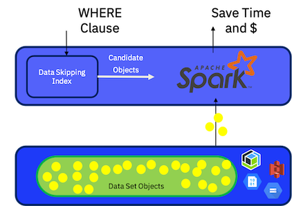

<!--
 -- Copyright 2021 IBM Corp.
 -- SPDX-License-Identifier: Apache-2.0
 -->

# Data Skipping

!!! note
    This section explains the concepts that are use in Xskipper.   
    For usage details go to the [Getting Started Page](/getting-started/quick-start-guide/).

Data skipping can significantly boost the performance of SQL queries by skipping over irrelevant data objects or files based on summary metadata associated with each object.

For every column in the object, the summary metadata might include minimum and maximum values, a list or bloom filter of the appearing values, or other metadata which succinctly represents the data in that column. We call this metadata a *data skipping index* (or simply index), and it is used during query evaluation to skip over objects which have no relevant data.

Xskipper supports all of Spark's native data formats, including Parquet, ORC, CSV, JSON and Avro. Data skipping is a performance optimization feature which means that using data skipping does not affect the content of query results.

Xskipper can be used to easily define new data skipping index types using a concept we call [Extensible Data Skipping](/concepts/extensible).

For more information about usage see:

- [Quick Start Guide](/getting-started/quick-start-guide)
- [Example Notebooks](/getting-started/sample-notebooks)
- [API Reference](/api/api-reference)
