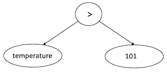
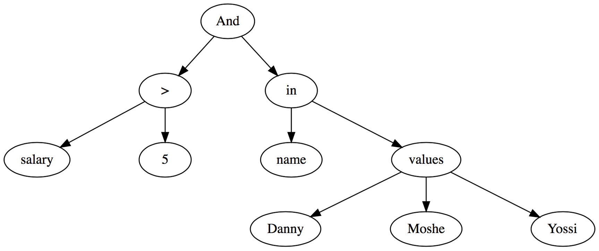
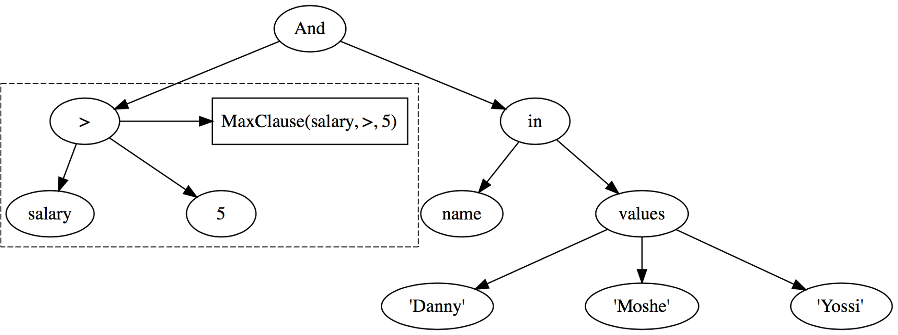
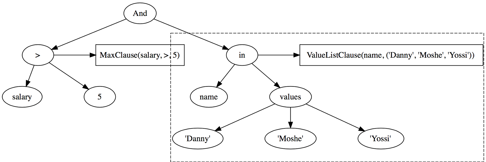

<!--
 -- Copyright 2021 IBM Corp.
 -- SPDX-License-Identifier: Apache-2.0
 -->

# Query Evaluation Flow

## Definitions

### Clause

We analyze Expression Trees and label tree nodes with **Clauses**.

A **Clause** is a boolean condition that can be applied to a data subset (i.e, object) $S$, typically by inspecting its metadata.
For a Clause $c$ and a (boolean) query expression $e$, we say that $c$ **represents** $e$ (denoted by $c \wr e$ ), if for every object $S$, whenever there exists a row $r \in S$ that satisfies $e$, then  $S$ satisfies $c$.
This means that if $S$ does not satisfy $c$, then $S$ can be safely skipped when evaluating the query expression $e$.

For example, given the expression $e = temp > 101$ the clause $c = \max_{r \in S} temp(r) > 101$ **represents** $e$ (denoted by $c \wr e$ ).
Therefore, objects where $c = \max_{r \in S} temp(r) <= 101$ can be safely skipped

### Filter

The labeling process of Expression Trees is done using **filters**.
An algorithm A is a**filter** if it performs the following action: When given an expression tree $e$ as input,
for every (boolean valued) vertex $v$ in $e$, it adds a set of clauses $C$ s.t $\forall c \in C$: $c \wr v$.

For example, given the expression $e = temp > 101$:



A filter $f$ might label the Expression Tree using a `MaxClause`:


`MaxClause(c,>,v)` is defined as $c = \max_{r \in S} c(r) > v$ Where for a `c` is the column name `v` is the value. Since `MaxClause(temperature,>,101)` represents the node to which it was applied, $f$ acted as a filter.

## Clause Translator

A component which translates a Clause to a specific implementation according to the metadatastore type.

## Query Evaluation Flow


Query evaluation is done in 2 phases:

1. A query’s Expression Tree $e$ is labelled using a set of clauses

    1. The clauses are combined to provide a single clause which represents $e$.

    2. The labelling process is extensible, allowing for new index types and UDFs.


2. The clause is translated to a form that can be applied at the metadata store to filter out objects which can be skipped during query run time.

### A simple example

For example, given the query:
```SQL
SELECT *
FROM employees
WHERE salary > 5 AND
name IN (‘Danny’, ’Moshe’, ’Yossi’)
```

The Expression Tree can be visualized as following:



Assuming we have a `MinMax` Index for the `salary` column (store minimum and maximum values for each object) and a
`ValueList` Index on the `name` column (storing the distinct list of values for each object).

- Applying the `MinMax` filter results in:



- Applying the `ValueList` filter on the results of the previous filter results in:



- Finally we generate a combined Abstract Clause:
```
AND(MaxClause(salary, >, 5),ValueListClause(name, ('Danny', 'Moshe', 'Yossi')))
```

This clause will be translated to a form that can be applied at the metadata store to filter out objects which can be skipped during query run time